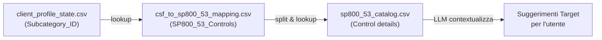

# Roadmap: Integrazione ProfileManager + Pandas Agent per l'Intervista NIST CSF 2.0

## Analisi dello Stato Attuale

### Componenti Esistenti
| Componente | File | Stato | Ruolo |
|---|---|---|---|
| **ProfileManager** | [profile_manager.py](file:///c:/Users/apote/Desktop/cerutti/Progetto-Computer-Security/profile_manager.py) | ✅ Pronto | State machine su [client_profile_state.csv](file:///c:/Users/apote/Desktop/cerutti/Progetto-Computer-Security/data/cleaned/client_profile_state.csv) (308 righe × 24 colonne) |
| **ManualPandasAgent** | [pandas_agent_manual.py](file:///c:/Users/apote/Desktop/cerutti/Progetto-Computer-Security/pandas_agent_manual.py) | ✅ Pronto | RAG engine ReAct per query su dataframes |
| **NISTDataLoader** | [nist_data_loader.py](file:///c:/Users/apote/Desktop/cerutti/Progetto-Computer-Security/nist_data_loader.py) | ✅ Pronto | Loader con cache per tutti i CSV |
| **DialogueManager** | [dialogue_manager.py](file:///c:/Users/apote/Desktop/cerutti/Progetto-Computer-Security/dialogue_manager.py) | 🟡 Parziale | Profilazione iniziale azienda, NON integrato con ProfileManager |

### Struttura Dati Chiave

- **[client_profile_state.csv](file:///c:/Users/apote/Desktop/cerutti/Progetto-Computer-Security/data/cleaned/client_profile_state.csv)** (308 × 24): Template profilo con 6 colonne catalogo + 17 colonne profilo + `Completion_Status`
- **[csf_to_sp800_53_mapping.csv](file:///c:/Users/apote/Desktop/cerutti/Progetto-Computer-Security/data/cleaned/csf_to_sp800_53_mapping.csv)** (108 × 5): Mappa `Subcategory_ID` → `SP800_53_Controls`
- **[sp800_53_catalog.csv](file:///c:/Users/apote/Desktop/cerutti/Progetto-Computer-Security/data/cleaned/sp800_53_catalog.csv)** (1196 × 13): Catalogo completo dei controlli con Statement, Discussion, Baseline
- **[nist_tiers.csv](file:///c:/Users/apote/Desktop/cerutti/Progetto-Computer-Security/data/cleaned/nist_tiers.csv)** (4 × 3): I 4 tier NIST per il Target

### Flusso di Mapping per i Target (RAG)


---

## Proposta: 4 Fasi di Implementazione

### Fase 1 — Interview Loop Engine (CORE)

> **Obiettivo**: Creare il loop principale che connette ProfileManager → LLM → Utente → salvataggio.

#### [NEW] [interview_engine.py](file:///c:/Users/apote/Desktop/cerutti/Progetto-Computer-Security/interview_engine.py)

Classe [InterviewEngine](file:///c:/Users/apote/Desktop/cerutti/Progetto-Computer-Security/interview_engine.py#46-1357) che orchestra tutto il flusso:

1. **[start()](file:///c:/Users/apote/Desktop/cerutti/Progetto-Computer-Security/interview_engine.py#156-199)** — Inizializza, show progress, chiama `_interview_next()`
2. **`_interview_next()`** — Prende la prossima riga PENDING dal ProfileManager
3. **[_build_question(row_dict)](file:///c:/Users/apote/Desktop/cerutti/Progetto-Computer-Security/interview_engine.py#746-857)** — Usa i dati del catalogo (Function, Category, Subcategory_Description, Implementation_Examples) per costruire una domanda conversazionale professionale tramite LLM
4. **`_process_answer(row_dict, user_answer)`** — Invia la risposta all'LLM per estrazione strutturata nelle 17 colonne (Current_* e poi Target_*)
5. **`_save_and_advance(subcategory_id, extracted_dict)`** — Chiama `ProfileManager.update_row()` con status DONE

**Logica chiave del loop**:
```
while True:
    row = manager.get_next_pending()              # Prossima riga PENDING
    if row is None: break                         # Profilo completato!
    
    manager.update_row(row['Subcategory_ID'],     # Marca IN_PROGRESS
                       {'Completion_Status': 'IN_PROGRESS'})
    
    question = build_question(row)                # LLM formula domanda
    print(question)
    user_answer = input("> ")                     # Input utente
    
    extracted = extract_response(row, user_answer) # LLM → dizionario 17 colonne
    target_suggestions = get_target_suggestions(row) # RAG SP800-53
    
    # Mostra suggerimenti target, chiedi conferma
    final_data = confirm_targets(extracted, target_suggestions)
    
    manager.update_row(row['Subcategory_ID'],     # Salva e avanza
                       {**final_data, 'Completion_Status': 'DONE'})
```

---

### Fase 2 — Estrazione Strutturata delle Risposte

> **Obiettivo**: L'LLM scompone la risposta discorsiva dell'utente nelle colonne del profilo.

#### [MODIFY] [interview_engine.py](file:///c:/Users/apote/Desktop/cerutti/Progetto-Computer-Security/interview_engine.py)

Aggiungere il metodo `_extract_structured_response()`:

- **Input**: Risposta utente + contesto della subcategory
- **Output**: Dizionario con le colonne Current_*:
  ```json
  {
    "Included_in_Profile": "Yes/No",
    "Rationale": "...",
    "Current_Priority": "High/Medium/Low/N/A",
    "Current_Status": "...",
    "Current_Policies_Processes_Procedures": "...",
    "Current_Internal_Practices": "...",
    "Current_Roles_and_Responsibilities": "...",
    "Current_Selected_Informative_References": "...",
    "Current_Artifacts_and_Evidence": "..."
  }
  ```
- **Tecnica**: Prompt ingegnerizzato con istruzioni specifiche per ogni campo + output JSON obbligatorio

---

### Fase 3 — RAG per Suggerimenti Target (SP800-53)

> **Obiettivo**: Per ogni subcategory, proporre obiettivi target basati sui controlli SP800-53 rilevanti.

#### [MODIFY] [interview_engine.py](file:///c:/Users/apote/Desktop/cerutti/Progetto-Computer-Security/interview_engine.py)

Aggiungere il metodo `_get_target_suggestions()`:

1. **Lookup mapping**: Da [csf_to_sp800_53_mapping.csv](file:///c:/Users/apote/Desktop/cerutti/Progetto-Computer-Security/data/cleaned/csf_to_sp800_53_mapping.csv), prende il campo `SP800_53_Controls` per la `Subcategory_ID` corrente
2. **Split controlli**: Divide la stringa (es. `"CM-8, PM-5"`) in una lista
3. **Fetch dettagli**: Per ogni controllo, cerca in [sp800_53_catalog.csv](file:///c:/Users/apote/Desktop/cerutti/Progetto-Computer-Security/data/cleaned/sp800_53_catalog.csv) i campi `Control_Name`, `Control_Statement`, `Discussion`
4. **Query LLM**: Passa i dettagli dei controlli al Pandas Agent o direttamente all'LLM con un prompt:
   > "Basandoti su questi controlli SP800-53 e sulla situazione attuale del cliente, suggerisci un Target_Priority, Target_CSF_Tier, e le Target_Policies/Practices/Roles da adottare."
5. **Output**: Dizionario con le colonne Target_*

**Esempio di flusso**:
```
Subcategory_ID: ID.AM-1  →  SP800_53_Controls: "CM-8, PM-5"
    → sp800_53_catalog[CM-8]: "Information System Component Inventory..."
    → sp800_53_catalog[PM-5]: "System Inventory..."
    → LLM: suggerisci target basati su questi controlli
    → Target_Priority: "High", Target_CSF_Tier: "Tier 3"...
```

---

### Fase 4 — Integrazione Dialogue Manager + Review/Revisione

> **Obiettivo**: Connettere il discovery iniziale (settore, size, maturità) al loop di intervista e aggiungere la possibilità di revisione.

#### [MODIFY] [dialogue_manager.py](file:///c:/Users/apote/Desktop/cerutti/Progetto-Computer-Security/dialogue_manager.py)

- Far sì che, dopo la fase di COMPLETION del company discovery, il [DialogueManager](file:///c:/Users/apote/Desktop/cerutti/Progetto-Computer-Security/dialogue_manager.py#72-743) passi il controllo a [InterviewEngine](file:///c:/Users/apote/Desktop/cerutti/Progetto-Computer-Security/interview_engine.py#46-1357)
- Il [CompanyProfile](file:///c:/Users/apote/Desktop/cerutti/Progetto-Computer-Security/dialogue_manager.py#39-57) raccolto venga usato per contestualizzare le domande (es. "Come azienda sanitaria di medie dimensioni...")

#### [MODIFY] [interview_engine.py](file:///c:/Users/apote/Desktop/cerutti/Progetto-Computer-Security/interview_engine.py)

- Aggiungere comandi speciali durante l'intervista:
  - `/progress` — Mostra progresso corrente
  - `/skip` — Salta subcategory, marca come "N/A"
  - `/review <ID>` — Riapri una subcategory DONE per modifica
  - `/export` — Esporta profilo parziale
  - `/quit` — Salva e esci (potrà riprendere dopo grazie a PENDING)

---

## User Review Required

> [!IMPORTANT]
> **Ordine di implementazione**: Le fasi sono pensate per essere implementate sequenzialmente. Ogni fase produce un risultato testabile. Preferisci partire dalla Fase 1+2 (loop + estrazione) per avere subito un prototipo funzionante, o preferisci un approccio diverso?

> [!IMPORTANT]
> **Gestione della granularità**: Le 308 subcategorie sono tante. Vuoi che il sistema faccia domande **per singola subcategory** (massima precisione) o **per Category/Function** (più veloce, raggruppando subcategorie simili)?

> [!IMPORTANT]
> **Lingua dell'intervista**: L'interfaccia utente e le domande dell'LLM devono essere in **italiano** o in **inglese**?

---

## Phase 3: Two-Phase Interview Loop (Current -> Target)

Currently, the engine asks only one question and extracts data into the `Current_*` fields. The goal is to extend this so that after compiling the current state, the engine asks a follow-up question to establish the "Target"

## Interactive Confirmation Loops

### 1. Modifying Extraction Methods
I will update both [_extract_response](file:///c:/Users/apote/Desktop/cerutti/Progetto-Computer-Security/interview_engine.py#957-1138) (Current) and [_extract_target_response](file:///c:/Users/apote/Desktop/cerutti/Progetto-Computer-Security/interview_engine.py#1156-1299) (Target) in [interview_engine.py](file:///c:/Users/apote/Desktop/cerutti/Progetto-Computer-Security/interview_engine.py) to accept optional `previous_extracted` and `feedback` arguments. If these arguments are provided, the system will use a specific prompt asking the LLM to refine the existing JSON based on the user's feedback, instead of extracting from scratch.

### 2. Updating the Interview Loop
Inside [_run_interview_loop](file:///c:/Users/apote/Desktop/cerutti/Progetto-Computer-Security/interview_engine.py#337-536), after extracting data for Phase 1, I will introduce a `while True:` loop:
1. Print the extracted JSON.
2. Prompt: `Are these details correct? (Press Enter to confirm, or type your corrections below)`
3. If the user hits enter or types "yes", save and proceed to Phase 2.
4. If the user types corrections, pass the feedback back into [_extract_response](file:///c:/Users/apote/Desktop/cerutti/Progetto-Computer-Security/interview_engine.py#957-1138) to regenerate the JSON, and loop back to step 1.

I will implement the exact same flow for Phase 2 (Target) before saving the final progress.

#### [MODIFY] interview_engine.py(file:///c:/Users/apote/Desktop/cerutti/Progetto-Computer-Security/interview_engine.py) AND the newly extracted `Current_*` values.
    *   Generate a **new question** ([_build_target_question()](file:///c:/Users/apote/Desktop/cerutti/Progetto-Computer-Security/interview_engine.py#858-952)) asking the user for their goals regarding the `Target_*` columns.
    *   User answers.
    *   Extract ([_extract_target_response()](file:///c:/Users/apote/Desktop/cerutti/Progetto-Computer-Security/interview_engine.py#1156-1299)) into the `Target_*` columns:
        *   `Target_Priority`
        *   `Target_CSF_Tier`
        *   `Target_Policies_Processes_Procedures`
        *   `Target_Internal_Practices`
        *   `Target_Roles_and_Responsibilities`
        *   `Target_Selected_Informative_References`
    *   Mark `Completion_Status` as `DONE` and save.

### Additions to Application Logic ([interview_engine.py](file:///c:/Users/apote/Desktop/cerutti/Progetto-Computer-Security/interview_engine.py))

*   **Modify [run()](file:///c:/Users/apote/Desktop/cerutti/Progetto-Computer-Security/interview_engine.py#1330-1344) loop**: Split the single interaction into a loop with two distinct LLM interaction turns per subcategory.
*   **New Method [_build_target_question()](file:///c:/Users/apote/Desktop/cerutti/Progetto-Computer-Security/interview_engine.py#858-952)**:
    *   Prompt will include: Subcategory context, SP800-53 context, AND a summary of the extracted `Current` state.
    *   Instructs LLM to ask: "Given your current state is X, what is your target state regarding priority, tier, policies, practices, responsibilities, and references?"
*   **New Method [_extract_target_response()](file:///c:/Users/apote/Desktop/cerutti/Progetto-Computer-Security/interview_engine.py#1156-1299)**:
    *   Prompt will extract specifically into the `Target_*` columns.
*   **Prompt Refinements (from Notes)**:
    *   Address point 1 from [AppuntiSullaCompilazione.txt](file:///c:/Users/apote/Desktop/cerutti/Progetto-Computer-Security/AppuntiSullaCompilazione.txt): Explicitly ask for "Priority" and all other fields in both prompts.
    *   Address point 3 from notes: Specify in the question generation that the auditor is asking about the specific "company/entity being profiled".

---

## Phase 5: Multi-Model Architecture

To improve speed and user experience during the interview loop, we will decouple the models used by the system.

1.  **Pandas Agent (Heavy Lifting)**: Will continue to use `gpt-oss` (20B parameters) which is excellent for code generation and complex RAG queries over CSVs.
2.  **Interview Engine (Conversational & Extraction)**: Can be configured to use much faster models like `qwen3` (4B), `phi4` (14B), or `llama3.2` (3B) available on the UniBS cluster.

### Proposed Changes
*   **Modify `InterviewEngine.__init__`**: Accept two separate model arguments: `interview_model_name` (default: `qwen3` or user choice) and `pandas_agent_model_name` (default: `gpt-oss`).
*   **Startup Prompt**: Implement a CLI prompt in the `if __name__ == "__main__":` block to let the user select their preferred interview model from a list of available cluster models (`qwen3`, `phi4-mini`, `llama3.2`, `gpt-oss`, etc.) before starting the session menu.

---

## Interactive Confirmation Loops & Subcategory Revision

### 1. Modifying Extraction Methods
I will update both [_extract_response](file:///c:/Users/apote/Desktop/cerutti/Progetto-Computer-Security/interview_engine.py#957-1138) (Current) and [_extract_target_response](file:///c:/Users/apote/Desktop/cerutti/Progetto-Computer-Security/interview_engine.py#1156-1299) (Target) in [interview_engine.py](file:///c:/Users/apote/Desktop/cerutti/Progetto-Computer-Security/interview_engine.py) to accept optional `previous_extracted` and `feedback` arguments. If these arguments are provided, the system will use a specific prompt asking the LLM to refine the existing JSON based on the user's feedback, instead of extracting from scratch.

### 2. Updating the Interview Loop
Inside [_run_interview_loop](file:///c:/Users/apote/Desktop/cerutti/Progetto-Computer-Security/interview_engine.py#337-536), after extracting data for Phase 1, I will introduce a `while True:` loop:
1. Print the extracted JSON.
2. Prompt: `Are these details correct? (Press Enter to confirm, or type your corrections below)`
3. If the user hits enter or types "yes", save and proceed to Phase 2.
4. If the user types corrections, pass the feedback back into [_extract_response](file:///c:/Users/apote/Desktop/cerutti/Progetto-Computer-Security/interview_engine.py#957-1138) to regenerate the JSON, and loop back to step 1.

I will implement the exact same flow for Phase 2 (Target) before saving the final progress.

### 3. Subcategory Revision Mode
When the user chooses to resume an existing profile, they should be presented with two options before starting the bulk interview loop:
1. `[1] Resume from where you left off` (Default behavior)
2. `[2] Modify a specific subcategory`

If they choose option 2, the engine will enter a continuous revision loop:
- Prompt for the `Subcategory_ID` to edit (e.g. `ID.AM-01`), or `/quit`.
- Fetch the catalog context using [_fetch_catalog_context](file:///c:/Users/apote/Desktop/cerutti/Progetto-Computer-Security/interview_engine.py#585-741) specifically for this ID.
- Load the current state of that row from `self.manager.df`.
- Trigger the interactive confirmation loop for the CURRENT phase using the loaded row.
- Trigger the interactive confirmation loop for the TARGET phase using the loaded row.
- Save the updated row back to the CSV.

#### [MODIFY] interview_engine.py(file:///c:/Users/apote/Desktop/cerutti/Progetto-Computer-Security/interview_engine.py)ti per una subcategory nota (es. ID.AM-1 → CM-8, PM-5)

### Verifica Manuale
-   **End-to-end**: Avviare l'interview engine, rispondere a 2-3 domande, verificare che [client_profile_state.csv](file:///c:/Users/apote/Desktop/cerutti/Progetto-Computer-Security/data/cleaned/client_profile_state.csv) venga aggiornato correttamente
-   **Persistenza**: Interrompere e riavviare, verificare che il sistema riprenda dall'ultima riga PENDING
