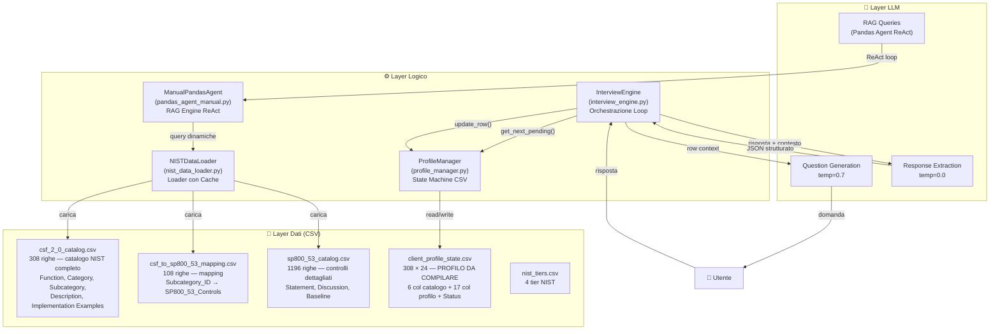
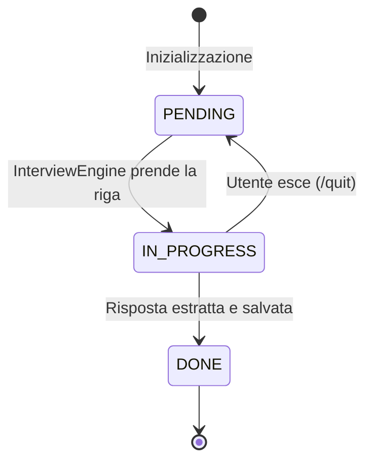
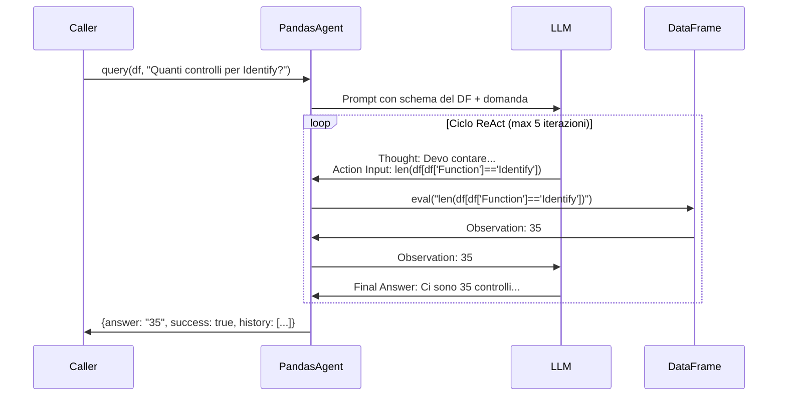
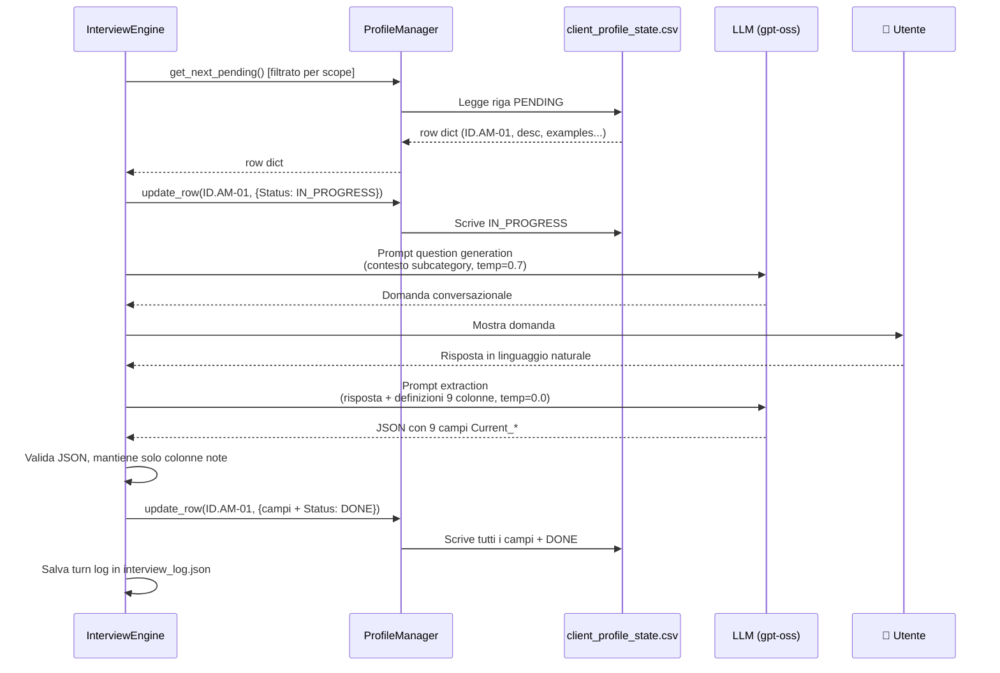

# Architettura del Sistema: Auditor Virtuale NIST CSF 2.0

## 1. Obiettivo del Progetto

Il progetto realizza un **Assistente/Auditor Virtuale Autonomo** basato su LLM per compilare il **NIST CSF 2.0 Organizational Profile** di un'azienda. Invece di compilare manualmente un foglio con 308 sottocategorie × 17 colonne, il sistema conduce un'**intervista conversazionale** guidata dall'IA: pone domande, interpreta le risposte in linguaggio naturale e le mappa automaticamente nei campi strutturati del profilo.

---

## 2. Panoramica dell'Architettura



---

## 3. Descrizione dei Componenti

### 3.1 [ProfileManager](file:///c:/Users/apote/Desktop/cerutti/Progetto-Computer-Security/profile_manager.py#15-154) — La State Machine

> **File**: [profile_manager.py](file:///c:/Users/apote/Desktop/cerutti/Progetto-Computer-Security/profile_manager.py)

Il [ProfileManager](file:///c:/Users/apote/Desktop/cerutti/Progetto-Computer-Security/profile_manager.py#15-154) gestisce il file [client_profile_state.csv](file:///c:/Users/apote/Desktop/cerutti/Progetto-Computer-Security/data/cleaned/client_profile_state.csv) come un **database di stato**. Ogni riga rappresenta una sottocategoria NIST e possiede una colonna `Completion_Status` con tre stati possibili:



**Metodi principali**:

| Metodo | Funzione |
|---|---|
| [__init__()](file:///c:/Users/apote/Desktop/cerutti/Progetto-Computer-Security/pandas_agent_manual.py#31-65) | Carica il CSV esistente o ne crea uno nuovo dal catalogo CSF, aggiungendo le 17 colonne profilo + `Completion_Status` |
| [get_next_pending()](file:///c:/Users/apote/Desktop/cerutti/Progetto-Computer-Security/profile_manager.py#93-101) | Restituisce il primo record in stato `PENDING` come dizionario |
| [update_row(id, dict)](file:///c:/Users/apote/Desktop/cerutti/Progetto-Computer-Security/profile_manager.py#102-120) | Aggiorna i campi di una riga identificata dal `Subcategory_ID` |
| [save_state()](file:///c:/Users/apote/Desktop/cerutti/Progetto-Computer-Security/profile_manager.py#86-92) | Scrive il DataFrame su file CSV (salvataggio incrementale) |
| [get_progress_summary()](file:///c:/Users/apote/Desktop/cerutti/Progetto-Computer-Security/profile_manager.py#121-134) | Restituisce conteggi PENDING/IN_PROGRESS/DONE |

**Dettaglio tecnico importante**: Le colonne profilo vengono forzate a dtype [str](file:///c:/Users/apote/Desktop/cerutti/Progetto-Computer-Security/dialogue_manager.py#55-57) al caricamento (tramite `dtype={col: str}`). Senza questo accorgimento, Pandas inferirebbe le colonne vuote come `float64`, causando un `TypeError` quando si tenta di scrivere stringhe come `"Yes"`.

---

### 3.2 [InterviewEngine](file:///c:/Users/apote/Desktop/cerutti/Progetto-Computer-Security/interview_engine.py#23-541) — L'Orchestratore

> **File**: [interview_engine.py](file:///c:/Users/apote/Desktop/cerutti/Progetto-Computer-Security/interview_engine.py)

È il **cuore del sistema**. Implementa il loop di intervista che connette tutti i componenti.

#### Flusso dettagliato di un singolo turno

```
1. engine._get_next_in_scope()
   └── Chiede al ProfileManager la prossima riga PENDING
       (filtrando solo le subcategory nel set SCOPE_SUBCATEGORIES)

2. engine._build_question(row)
   ├── Prende dal catalogo: Subcategory_ID, Category, Description, Implementation_Examples
   ├── Costruisce un prompt per l'LLM con il contesto della subcategory
   ├── Invia all'LLM (temperature=0.7 per varietà nel linguaggio)
   └── L'LLM restituisce una domanda conversazionale professionale

3. L'utente legge la domanda e scrive una risposta in linguaggio naturale

4. engine._extract_response(row, user_answer)
   ├── Costruisce un prompt di estrazione con:
   │   • Il contesto della subcategory (ID, categoria, descrizione)
   │   • La risposta dell'utente
   │   • Le definizioni precise delle 9 colonne Current_*
   ├── Invia all'LLM (temperature=0.0 per massimo determinismo)
   ├── L'LLM restituisce un JSON strutturato
   └── Il sistema valida il JSON e mantiene solo le colonne note

5. engine → ProfileManager.update_row()
   ├── Scrive il dizionario estratto nella riga corretta del CSV
   ├── Setta Completion_Status = "DONE"
   └── Salva il CSV su disco (persistenza incrementale)
```

#### Le due chiamate LLM sono fondamentalmente diverse

| Aspetto | Question Generation | Response Extraction |
|---|---|---|
| **Scopo** | Generare una domanda chiara | Estrarre dati strutturati |
| **Temperature** | 0.7 (creatività) | 0.0 (determinismo) |
| **Output atteso** | Testo libero | JSON rigoroso |
| **Fallback** | Domanda generica dal template | Risposta raw in `Current_Status` |

#### Modalità verbose vs. non-verbose

Il sistema ha due modalità controllate dal flag `--verbose`:

- **Non-verbose** (default): l'utente vede solo le domande, i dati estratti e i comandi. Pulito e professionale.
- **Verbose** (`--verbose`): mostra tutti i trace interni: prompt completi inviati all'LLM, risposte raw, reasoning tokens, conteggi token, parsing JSON. Utile per debug e per capire come il sistema "ragiona".

#### Comandi utente

| Comando | Effetto |
|---|---|
| `/progress` | Mostra quante subcategory sono state completate |
| `/skip` | Salta la subcategory corrente (marca come DONE/Skipped) |
| `/quit` | Salva tutto ed esce; al riavvio riprende da dove era rimasto |

---

### 3.3 [ManualPandasAgent](file:///c:/Users/apote/Desktop/cerutti/Progetto-Computer-Security/pandas_agent_manual.py#21-494) — Il Motore RAG

> **File**: [pandas_agent_manual.py](file:///c:/Users/apote/Desktop/cerutti/Progetto-Computer-Security/pandas_agent_manual.py)

Implementa un **agente ReAct** (Reasoning + Acting) per interrogare i dataset in linguaggio naturale. Questo è il motore di "RAG dinamico" del sistema.

#### Come funziona il pattern ReAct



**Principi chiave**:
1. L'LLM **non accede direttamente ai dati**: genera codice Python che viene eseguito in un ambiente sandbox (`eval` con namespace limitato a [df](file:///c:/Users/apote/Desktop/cerutti/Progetto-Computer-Security/Deliverable%201%20Computer%20Security.pdf), [pd](file:///c:/Users/apote/Desktop/cerutti/Progetto-Computer-Security/profile_manager.py#102-120), `len`, [str](file:///c:/Users/apote/Desktop/cerutti/Progetto-Computer-Security/dialogue_manager.py#55-57))
2. L'LLM **vede lo schema del DataFrame** (colonne, prime 3 righe, shape) ma non l'intero dataset
3. Il ciclo si ripete finché l'LLM non produce un `Final Answer` o si raggiunge il limite di iterazioni
4. Ogni step è **loggato** con dettaglio completo (prompt, risposta, reasoning, token usati)

---

### 3.4 [NISTDataLoader](file:///c:/Users/apote/Desktop/cerutti/Progetto-Computer-Security/nist_data_loader.py#15-166) — Il Loader con Cache

> **File**: [nist_data_loader.py](file:///c:/Users/apote/Desktop/cerutti/Progetto-Computer-Security/nist_data_loader.py)

Modulo di servizio che centralizza il caricamento dei CSV puliti. Implementa un sistema di **cache in memoria** per evitare riletture multiple dello stesso dataset. Carica tre dataset:

| Dataset | Righe | Uso |
|---|---|---|
| [csf_to_sp800_53_mapping.csv](file:///c:/Users/apote/Desktop/cerutti/Progetto-Computer-Security/data/cleaned/csf_to_sp800_53_mapping.csv) | 108 | Mapping subcategory → controlli SP800-53 |
| [pf_to_sp800_53_mapping.csv](file:///c:/Users/apote/Desktop/cerutti/Progetto-Computer-Security/data/cleaned/pf_to_sp800_53_mapping.csv) | ~150 | Mapping Privacy Framework → controlli |
| [sp800_53_catalog.csv](file:///c:/Users/apote/Desktop/cerutti/Progetto-Computer-Security/data/cleaned/sp800_53_catalog.csv) | 1196 | Catalogo completo dei controlli con dettagli |

---

## 4. I Dataset (Layer Dati)

### 4.1 [client_profile_state.csv](file:///c:/Users/apote/Desktop/cerutti/Progetto-Computer-Security/data/cleaned/client_profile_state.csv) — Il profilo da compilare

Questo è il **prodotto finale** dell'intero sistema. Ha 24 colonne:

| Gruppo | Colonne | Descrizione |
|---|---|---|
| **Catalogo** (6) | `Function`, `Function_Description`, `Category`, `Subcategory_ID`, `Subcategory_Description`, `Implementation_Examples` | Dati statici dal framework NIST CSF 2.0 |
| **Profilo Current** (9) | `Included_in_Profile`, `Rationale`, `Current_Priority`, `Current_Status`, `Current_Policies_Processes_Procedures`, `Current_Internal_Practices`, `Current_Roles_and_Responsibilities`, `Current_Selected_Informative_References`, `Current_Artifacts_and_Evidence` | Stato attuale dell'azienda — compilato dall'intervista |
| **Profilo Target** (7) | `Target_Priority`, `Target_CSF_Tier`, `Target_Policies_Processes_Procedures`, `Target_Internal_Practices`, `Target_Roles_and_Responsibilities`, `Target_Selected_Informative_References` | Obiettivi futuri — compilato nella Fase 3 con RAG SP800-53 |
| **Note** (2) | `Notes`, `Considerations` | Annotazioni aggiuntive |
| **Stato** (1) | `Completion_Status` | `PENDING` / `IN_PROGRESS` / `DONE` |

### 4.2 Catena di RAG per i Target (Fase 3 — futuro)

Per proporre obiettivi target intelligenti, il sistema userà una catena di lookup:

```
ID.AM-01 (subcategory)
    ↓ csf_to_sp800_53_mapping.csv (colonna SP800_53_Controls)
    ↓ "CM-8, PM-5"
    ↓ sp800_53_catalog.csv (lookup per Control_ID)
    ↓ CM-8: "Information System Component Inventory — Statement + Discussion"
    ↓ PM-5: "System Inventory — Statement + Discussion"
    ↓ LLM contestualizza in base al profilo corrente
    → Suggerimenti: Target_Priority, Target_CSF_Tier, Target_Policies...
```

---

## 5. Logging e Tracciabilità

Ogni esecuzione crea una cartella `interview_run_<timestamp>/` contenente:

- **`interview_log.json`**: Log completo di ogni turno con:
  - Contesto della sottocategoria (Function, Category, Description, Examples)
  - Prompt completo inviato all'LLM per generare la domanda
  - Risposta dell'LLM (content + reasoning tokens + token count)
  - Risposta dell'utente in linguaggio naturale
  - Prompt di estrazione inviato all'LLM
  - JSON estratto dall'LLM
  - Dati validati e salvati nel profilo

Questo consente la **piena trasparenza e riproducibilità**: è possibile ricostruire esattamente cosa il sistema ha fatto, quali prompt ha usato e come ha interpretato le risposte.

---

## 6. Diagramma di Sequenza Completo (un turno)



---

## 7. Riepilogo delle Tecnologie

| Componente | Tecnologia |
|---|---|
| Linguaggio | Python 3 |
| LLM Client | Libreria `openai` (nativa, no LangChain) |
| Dati | Pandas DataFrame + CSV |
| Pattern Agente | ReAct (Reasoning + Acting) |
| Modello LLM | `gpt-oss` su cluster GPU UniBS |
| Stato | State Machine su file CSV (PENDING → IN_PROGRESS → DONE) |
